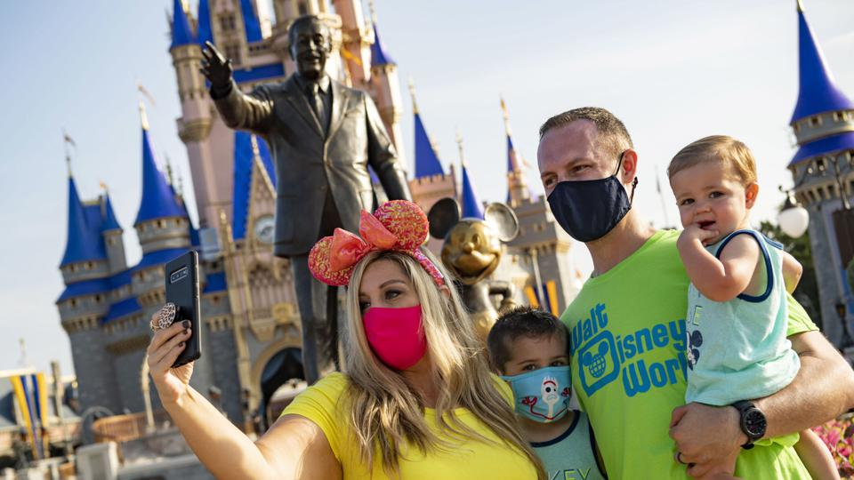

# Walt Disney World Loosens Mask Mandate

The Walt Disney World in Florida is now allowing guests to take pictures outdoors **without a mask** on starting *April 8th*. While they are still required to keep the masks on indoors, Walt Disney World has now started to loosen up on the mask policy. After already allowing people to *eat and drink with their masks off*, Walt Disney World continues to try and make the experience more enjoyable for their customers. **Disneyland Resort** in California is also set to reopen on *April 30th* after a year-long closure.

>Florida does not have a statewide mask mandate, but there are mask orders in effect in Orange and Osceola counties, where Walt Disney World is located.

This [article](https://www.forbes.com/sites/alisondurkee/2021/04/06/walt-disney-world-loosens-policy-on-mask-wearing/?sh=21ca1a375f77) captured how Walt Disney World customers have been acting during these times:

test
Of note:
- [Scuffles](https://www.orlandosentinel.com/business/tourism/os-bz-theme-parks-face-masks-outbreaks-20201124-g7je4csysvdspcnn7djsj3hsfe-story.html) are erupting over the COVID-19 rule
- [Disneyland Paris](https://www.forbes.com/sites/alisondurkee/2021/03/12/disneyland-paris-may-soon-be-the-only-disney-theme-park-closed-worldwide-as-shutdown-extends-again/?sh=238fd494c3ed) will be the only Disney theme park closed worldwide
- COVID-19 protocols are having a negative impact on [Disney World Workers](https://www.orlandosentinel.com/business/tourism/os-prem-disney-masks-covid-arrests-20210304-olv75latw5hnpkf7a6ccp3nila-story.html) trying to enforce the rules
